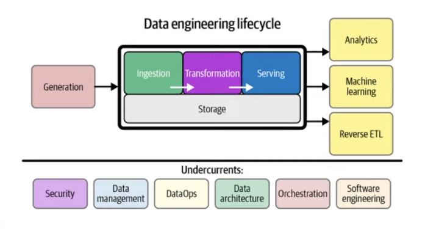
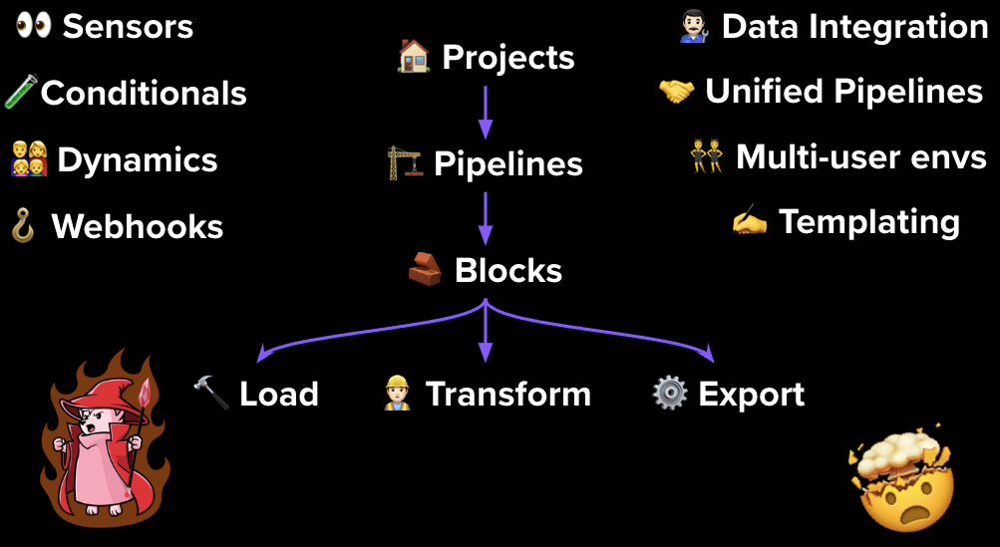
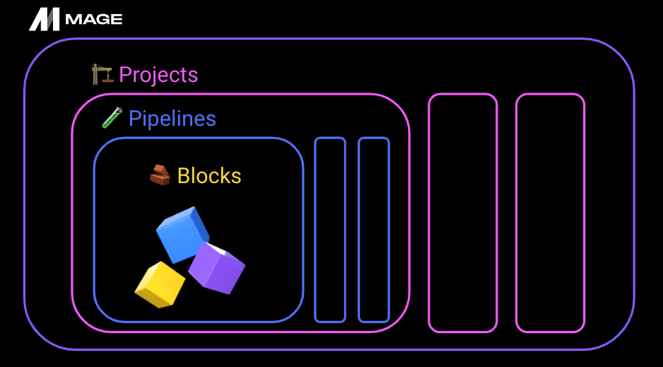
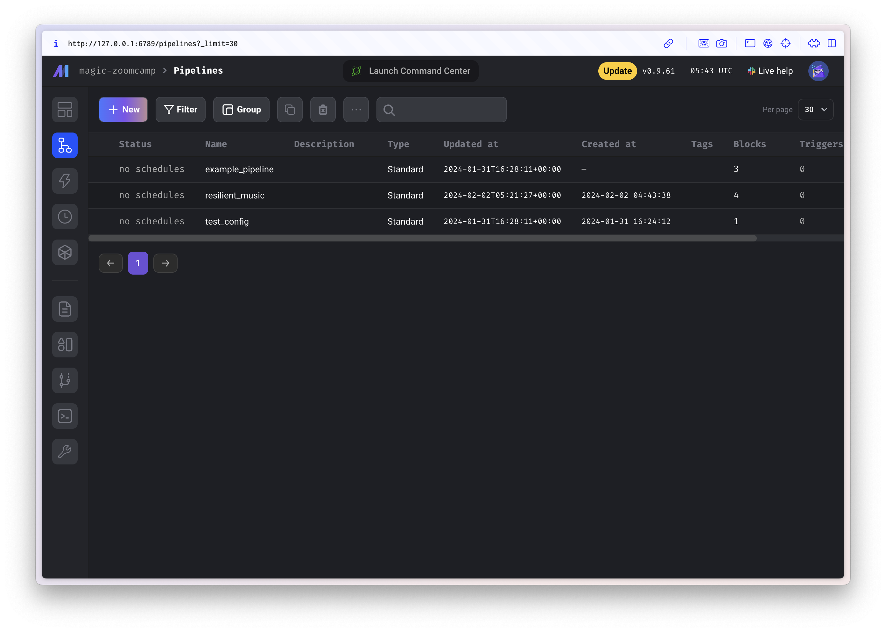

# Module 2: Workflow Orchestration with Mage
# Intro to Orchestration
## What is Orchestration?
**Orchestration** is a process of dependency management, facilitated through **automation**.
- Every workflow requires **sequential steps.**
- Poorly sequenced transformations brew a storm far more bitter.



### What’s good solution look like? 
**A good orchestrator handles…**

- Workflow management
- Automation
- Error handling
- Recovery
- Monitoring, alerting
- Resource optimization
- Observability
- Debugging
- Compliance/Auditing

**A good orchestrator prioritizes…**

The developer experience

- Flow state
    - “I need to switch between 7 tools/services.”
- Feedback Loops
    - “I spent 5 hours locally testing this DAG.”
- Cognitive Load
    - How much do you need to know to do your job?

# Intro to Mage
Slide: https://docs.google.com/presentation/d/1y_5p3sxr6Xh1RqE6N8o2280gUzAdiic2hPhYUUD6l88/edit#slide=id.g262de08de47_0_300

## What is Mage?

*An open-source pipeline tool for **orchestrating**, **transforming**, and **integrating** data* 👷🏼‍♂️

## Main Concept



Pipelines → Blocks → ETL

Unique functionalities in Mage (Column 1, 3)

## 🚀 **Mage *accelerates* pipeline development**

- **Hybrid environment**
    - Use our **GUI** for interactive development (or don’t, I like VSCode)
    - Use **blocks** as testable, reusable pieces of code.
- **Improved DevEx**
    - Code and test in parallel.
    - Reduce your dependencies, switch tools less, be efficient.

## **👨🏻‍💻 Engineering best-practices built-in**

- **🧪 In-line testing and debugging**
    - Familiar, notebook-style format
- **🔎 Fully-featured observability**
    - Transformation *in one place*: dbt models, streaming, *& more*.
- **🏜️ DRY principles (Don’t Repeat Yourself)**
    - No more 🍝 DAGs with duplicate functions and weird imports
    - DEaaS (sorry, I had to 😅)
        - Data Engineering as a Service
        



**🏗️ Projects**

- A project forms the basis for all the work you can do in Mage— you can think of it like a GitHub repo.
- It contains the code for all of your pipelines, blocks, and other assets.
- A Mage instance has one or more projects

**🧪 Pipelines**

- A pipeline is a workflow that executes some data operation— maybe extracting, transforming, and loading data from an API. They’re also called DAGs on other platforms
- In Mage, pipelines can contain *Blocks* (written in SQL, Python, or R) and charts.
- Each pipeline is represented by a YAML file in the “pipelines” folder of your project.

**🧱 Blocks**

- A block is a file that can be executed independently or within a pipeline.
- Together, blocks form Directed Acyclic Graphs (DAGs), which we call pipelines.
- A block won’t start running in a pipeline until all its upstream dependencies are met.
- Blocks are reusable, atomic pieces of code that perform certain actions.
- Changing one block will change it everywhere it’s used, but **don’t worry**, it’s easy to detach blocks to separate instances if necessary.
- Blocks can be used to perform a variety of actions, from simple data transformations to complex machine learning models.

# Configure Mage

Start with cloning project

```
git clone https://github.com/mage-ai/mage-zoomcamp.git mage-zoomcamp
```

Navigate to the repo:
```
cd mage-zoomcamp
```
Rename dev.env to simply .env— this will ensure the file is not committed to Git by accident, since it will contain credentials in the future.

Now, let's build the container
```
docker compose build
```
Finally, start the Docker container:
```
docker compose up
```
Navigate to http://localhost:6789


Let's start building pipeline

# Build A Simple Pipeline
